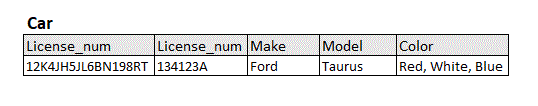
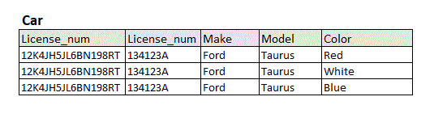
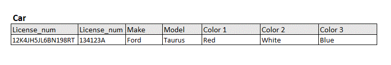
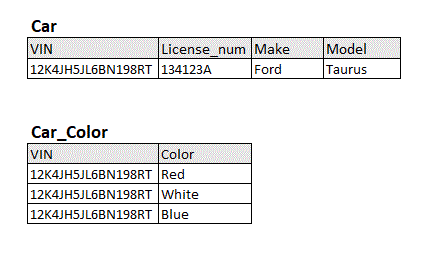
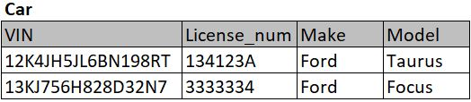
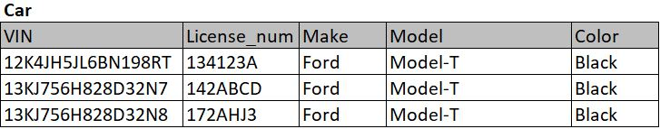
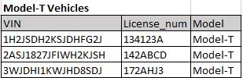
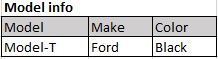

# Normalizing a Database

When creating a database, especially one that will be used to store large amounts of data, it's important to make sure that the data is stored as efficiently as possible. This can be accomplished by normalizing the database. Normalization is used to reduce redundancy and anomalies that can occur when inserting, deleting, and modifying entries in a database. There are several different "tiers" of normalization; this tutorial will go over the first two: 1st Normal Form (1NF) and 2nd Normal Form (2NF).

### What You'll Need to Know

This tutorial assumes you're already familiar with the basics of databases: relations, tuples, and the parts of tuples (keys, non-prime attributes, etc.) are important concepts for normalization.

## 1NF

The first tier of normalization is called "1NF" and is an important step in preparing for further normalization. The goal of 1NF is to make sure that all attributes of a tuple are broken down into atomic values; that is, all attributes contain a single value. Consider the tuple below:

Notice how the "Color" attribute contains "Red, White, Blue"? To achieve 1NF, the "Color" attribute must be broken down. But how do we achieve this?

There are 3 different methods we could use to fix this.

### 1. Add Tuples
One solution is to create a new tuple in the relation for every value, like so:

As you can see, there now exists a new tuple for every value in the "Color" attribute. Unfortunately, this method can lead to issues of bloated databases. For example, if we were to enter cars that all had at least two colors, it would more than double the size of the entire database. What's worse, if you tried to do use this method to handle multiple multi-valued attributes, the size of the database would increase exponentially for every value!

### 2. Add Columns
Another solution is to add more attributes to a tuple that will accommodate the maximum number of values an attribute can possess. For example, if we know that the maximum number of colors is 3, we could expand the tuple to:

There are some drawbacks to this method as well. First of all, it requires us to know exactly what the maximum number of values for an attribute is. Often times in the real world, while we can estimate how many values an attribute will have in general, it can be very difficult to predict the **maximum** number of values. And even if we can, that can lead to other issues. For our previous example, we assumed that the maximum number of colors was 3, but what if, in reality, it could contain every color in existence? If we assumed that every unique RGB combination was its own color, that would give us over 16.5 million colors! Trying to add a column for every one of those would defeat the purpose of normalization!

This isn't to say that adding columns is a bad solution, it is often used effectively in database design. However, it just means that we need to make sure we fully understand the what will be required of our database before implementing it.

### 3. Add Relations
The third solution that can be used to solve this issue is to create a whole new relation for the values of the attribute. In this case our example would appear as:

Notice that the "Color" attribute has been completely dropped from the original tuple, and is instead added to an entirely different tuple. This method is the most versatile of the three methods, as any number of value can be inserted into the accompanying relation without worrying about too many or too few columns in the main tuple. However, the drawback to this is that it can make some of the logic when accessing the data a little more complicated.

## Exercise 1
Consider the following tuples:

Use each method we've learned to normalize this relation to 1NF. Use the answer key at the end of this tutorial to check your work, but try to do it yourself first to get the most out of it.

## 2NF

Normal forms are cumulative so in order to put your relational schema in second normal form you must already have achieved first normal form.  Before covering 2NF it is important to understand the concept of functional dependencies.

### Functional Dependencies
If X and Y are attribute sets in your entity, then Y has a functional dependency on X (written as X -> Y) if we can know the value of Y in any tuple just by looking at the value of X.  This means that each value in the attribute set of Y appearing in a tuple maps to a single value of X in that tuple.  The value of X in a tuple implies the value of Y in that tuple.  Let's take a look at an example:

Looking at the schema for car we can see we have two models (Taurus and Focus) with the make Ford.  Make is functionally dependent on model (model -> make) because every time a car has one of these models we know that the make will be Ford.  Model is not functionally dependent on make however (make -/> model) because there are multiple models in this table (Taurus and Focus) with the make 'Ford'.

Functional dependency X -> Y is a full functional dependency if removing an attribute from X causes the functional dependency to no longer hold.  In our car example there is only one attribute in X which is make so this is obviously a full functional dependency but lets suppose that the only cars in our table are Ford model-T's as shown below.

In this table we can see that you can get your model-T in any color so long as its black!  Therefore by knowing the model (model-T) we know both the make and the color.  This is a partial functional dependency because if we were to remove the attribute color from X we would still have a functional dependency X -> Y where the model is functionally dependent on the make.

### Definition
Now that we have gone over the concept of functional and full functional dependencies we can finally define second normal form:

A relation is in second normal form if every attribute that is not a part of the candidate key is fully functionally dependent on the primary key.

### Removing Redundancies
If we think about the nature of functional dependencies we realize that in order for a key to uniquely identify every attribute in the table every attribute must be functionally dependent on the key.  Partial functional dependencies, however, introduce redundancies.  If an attribute in the set Y is functionally dependent on any attribute in the set X that is not a part of the key then that attribute in the set Y in unnecessary because it could simply be inferred.  

From our previous example all nonprime attributes are functionally dependent on the VIN.  If we know a cars model; however, why do we need to have the cars make in the table if we can just infer this from the model?  Additionally if we have a table that is only filled with Model-T cars then why do we need to know the make or the color since all Model-Ts are only available in black?

By transforming these partial functional dependencies into full functional dependencies we are removing redundancies in the table.  This is simply accomplished by removing any attribute in the table that can be inferred from a non-prime attribute.

## Exercise 2

Take the table of Model-T cars and create a table that removes all the redundant attributes from the relation.  Find a way to link that redundant info back to the table so that it can retained.

#Congratulations!
You've completed this tutorial! Now, you should have a good idea of how to get a database into 1NF and 2NF. If you wish to continue and make your database even less redundant and more efficient, the next step is to learn how to do 3NF and Boyce-Codd Normal Form (BCNF). Good luck with your database!

## Exercise 1 Answers
Here is how we solved Exercise 1 using the "Adding tuples" method:

Here is how we solved Exercise 1 using the "Adding columns" method:

Here is how we solved Exercise 1 using the "Adding a relation" method:

## Exercise 2 Answer

We removed "make" and color attributes from the table but left the model attribute (even though we know this is a table of Model-T cars).  This table is now in 2nd normal form because every element in the table is fully functionally dependent on the primary key VIN.  We created a second table with model info so that we could retain this data in the database without cluttering numerous vehicle tuples.

